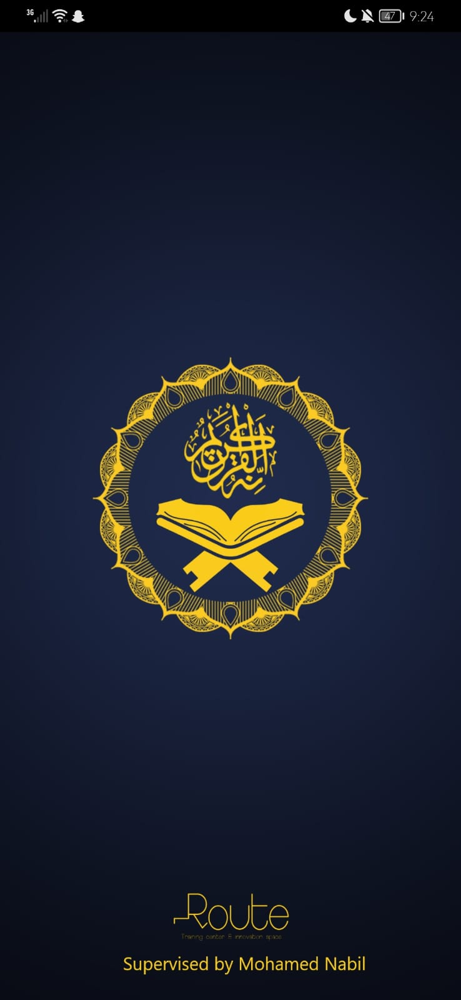
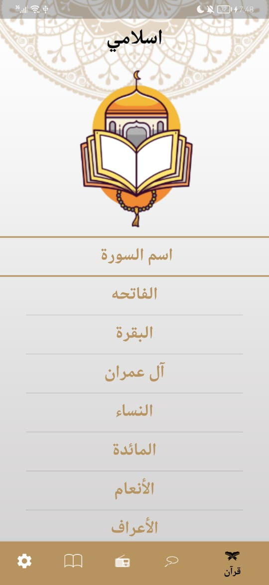
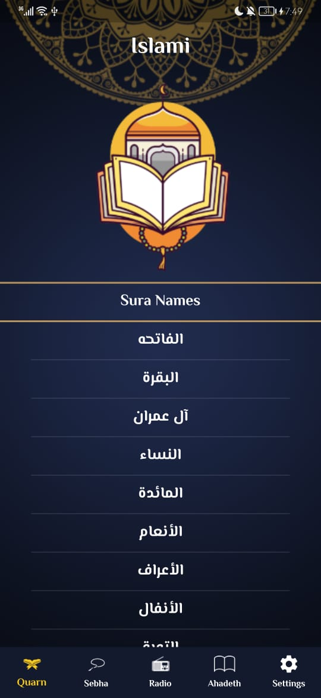
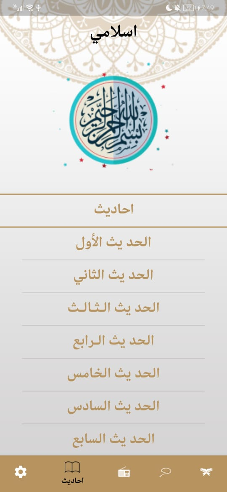
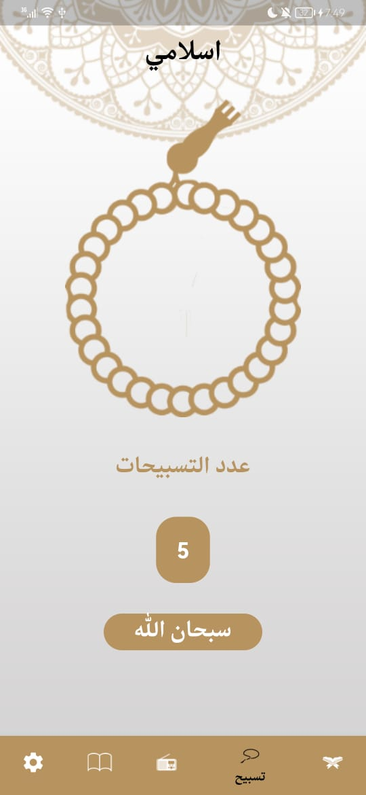
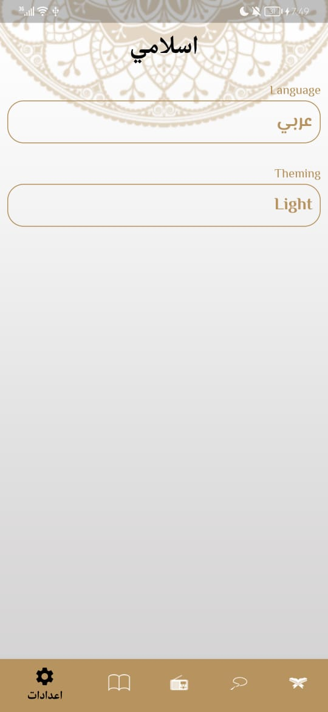
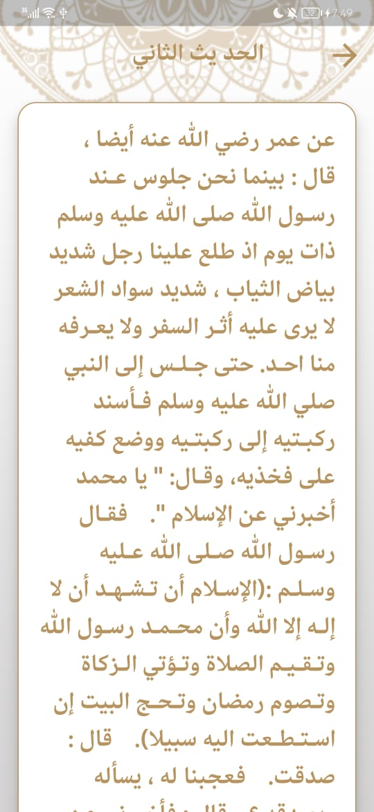

# 🕌 Islami Application - Flutter Project 📱

The Islami Application is a mobile application built using the Flutter framework with the integration of Provider State Management. This app aims to provide users with a comprehensive collection of the Quran, Ahadeeth (traditions of the Prophet Muhammad), and Sebha (a form of Islamic prayer using prayer beads), all within a convenient and user-friendly interface. This document serves as a guide to understand the project structure, features, and how to set up and run the application. 

## Features ✨

The Islami Application offers the following features:

1. **Quran:** Access a complete collection of the Quranic verses, allowing users to read, and explore the holy text. Users can navigate through chapters (Surahs) and verses (Ayahs) with ease. 📖

2. **Ahadeeth:** Access a curated collection of authentic traditions and sayings of the Prophet Muhammad. This feature provides users with insights into the teachings of Islam and its practices. ☪️

3. **Sebha:** This feature facilitates the recitation of Islamic prayers using a digital prayer bead counter. Users can engage in the practice of Sebha (also known as Tasbeeh) to remember and praise Allah. 📿

4. **User-Friendly Interface, Localization ans Theming:** The app boasts an intuitive and easy-to-use interface, making it convenient for users to navigate through various sections and access Islamic texts effortlessly. 🌟

## 📸 Screenshots

Click to expand

### Splash Screen

### Quran Screen

### Quran Screen Dark mode

### Ahadeth Screen

### Sebha Screen

### Settings Screen

### hadeth Screen

